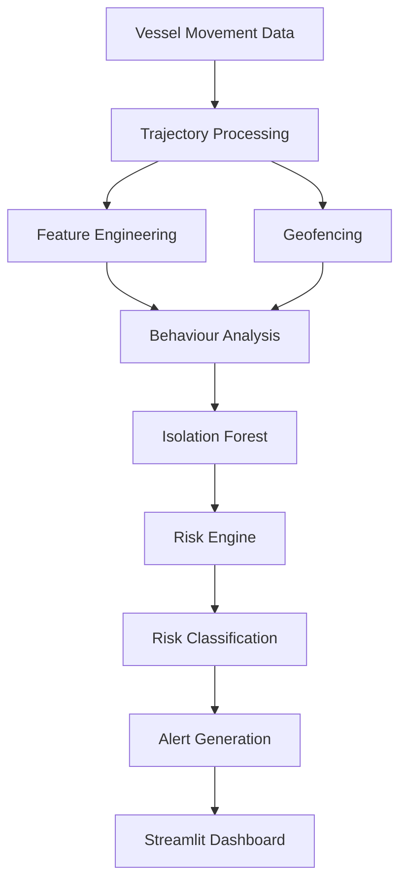

# Illegal Fishing Detection System

An AI-assisted maritime vessel monitoring and suspicious-behaviour detection prototype.
The system monitors simulated vessel movement across a defined maritime region, identifies
anomalous behaviour patterns, detects restricted-zone violations, calculates dynamic
per-vessel risk scores, and generates prioritised alerts — all within an interactive
Streamlit dashboard.

> **Note:** The system runs in two modes. **Simulated** (default) uses a built-in
> synthetic vessel fleet. **Historical AIS** ingests vessel-movement data from a local
> CSV file via the AIS loader. The project does **not** provide a live AIS feed, real-time
> satellite data, or production maritime surveillance — ingestion is from historical/local
> data only.

---

## Key Features

- Interactive dark-themed maritime map (Folium + CartoDB tiles)
- Real-time vessel fleet overview with risk-coloured markers
- Restricted-zone geofencing using ray-casting point-in-polygon geometry
- Behavioural feature extraction from simulated vessel trajectories
- Speed anomaly detection
- Loitering detection based on displacement ratio and speed
- Trajectory and heading variance analysis
- Zone proximity scoring
- AIS signal gap detection
- Isolation Forest unsupervised anomaly detection
- Dynamic risk scoring (0–100) with weighted factor contributions
- Risk classification: LOW / MEDIUM / HIGH
- Dynamic alert generation sorted by severity
- Per-vessel anomaly score and risk factor breakdown in the sidebar inspector

---

## System Architecture



---

## How It Works

### 1. Vessel Data Generation (`data_generator.py`)

A fleet of 18 simulated vessels is defined with base positions, speeds, headings, and
behaviour types. Trajectories are generated programmatically — the shape of each
trajectory (loitering circle, erratic random walk, straight transit, drift) is
determined by the vessel's assigned behaviour profile. A fixed random seed ensures
results are reproducible.

### 2. Geofencing (`geofencing.py`)

Each vessel's current coordinates are checked against three restricted fishing-zone
polygons using the **ray-casting (Jordan curve) algorithm** — no external geometry
library is required. The module also computes minimum distance from each vessel to the
nearest zone boundary, producing a proximity score used downstream by the risk engine.

### 3. Feature Engineering (`feature_engineering.py`)

Nine numerical behavioural features are extracted per vessel from its trajectory:

| Feature | Description |
|---|---|
| `speed` | Current reported speed (knots) |
| `speed_deviation` | Deviation from normal fishing speed range |
| `heading_variance` | Variance of course changes along the trajectory |
| `displacement_ratio` | Net displacement ÷ total path length (0 = loitering, 1 = straight) |
| `loitering_score` | Combined loitering indicator (displacement + speed) |
| `path_length_deg` | Total arc-length of trajectory |
| `bearing_change_rate` | Mean absolute bearing change per step |
| `zone_proximity_norm` | Normalised proximity to nearest restricted zone |
| `erratic_score` | Std-dev of step lengths normalised by mean |

### 4. Anomaly Detection (`anomaly_detector.py`)

An **Isolation Forest** model (scikit-learn, 200 estimators, contamination=0.20,
random\_state=42) is fitted on the 18-vessel feature matrix. The model's raw
`decision_function` output is inverted and normalised to a `[0, 1]` anomaly score where
**1.0 = most anomalous**. Vessels scoring above 0.55 are flagged as anomalous.

The model is trained on every pipeline run. No pre-trained model file is persisted in
this prototype.

### 5. Risk Engine (`risk_engine.py`)

A transparent weighted scoring function combines multiple signals into a 0–100 risk
score:

| Signal | Max contribution |
|---|---|
| Restricted zone violation | 40 pts |
| ML anomaly score (Isolation Forest) | 25 pts |
| Loitering | 20 pts |
| Zone proximity | 15 pts |
| Speed anomaly | 12 pts |
| Erratic movement | 10 pts |
| AIS signal gap | 10 pts |
| Combined suspicious indicators boost | 8 pts |

Risk classification thresholds: **HIGH ≥ 55**, **MEDIUM ≥ 20**, **LOW < 20**.

> These weights and thresholds are prototype values. Domain calibration against real
> maritime enforcement data would be required before operational use.

### 6. Alert Generation (`risk_engine.py → generate_alerts()`)

Alerts are generated dynamically from the computed risk results — there are no
hard-coded alert messages. Each alert includes vessel ID, severity level, and a
human-readable message describing the primary risk factor. Alerts are sorted HIGH first,
then by descending risk score.

### 7. Dashboard (`app.py`)

The Streamlit dashboard is built on the enriched vessel DataFrame produced by the
pipeline. It provides:

- **Metrics row**: total vessels, HIGH/MEDIUM/LOW counts, active alert count
- **Interactive map**: dark-tiled Folium map with restricted zone polygons, vessel
  movement trails, and risk-coloured CircleMarkers with popup detail cards
- **Alerts panel**: dynamically generated alerts displayed as severity-coded cards
- **Fleet status table**: all vessels ranked by risk score
- **Vessel inspector** (sidebar): select any vessel ID to view speed, heading,
  coordinates, risk score, zone status, Isolation Forest anomaly score, AIS gap
  warning, computed risk factor breakdown, and raw feature values
- **Detection pipeline diagram**: six-stage visual overview
- **High-risk analysis panel**: factor breakdown cards for HIGH-risk vessels
- **Isolation Forest scores table**: full fleet anomaly scores ranked by score

---

## Data Sources

The dashboard sidebar provides a **Data Source** selector with two modes.

### Simulated (default)

Uses the built-in synthetic vessel fleet from `data_generator.py`
(`generate_vessel_dataframe()` + `build_all_trajectories()`). This is the original,
fully reproducible demonstration fleet and remains the default. Nothing about this mode
has changed.

### Historical AIS

Ingests vessel-movement data from a **local historical AIS CSV** via `ais_loader.py`,
then feeds the normalised result through the exact same downstream pipeline (geofencing →
feature engineering → Isolation Forest → risk engine → alerts). No separate pipeline, no
duplicated risk engine or anomaly detector.

AIS (Automatic Identification System) data describes vessel **movement only**. It does not
by itself prove illegal fishing. Suspicious-behaviour detection is performed entirely by
the downstream analysis pipeline. The loader therefore does **not** assign any
fishing/illegal behaviour label to raw AIS records.

> This is **historical AIS data ingestion** from a local CSV — not a live AIS feed, not a
> commercial API, and not real-time satellite data. No API key or network access is
> required.

#### Expected CSV schema

The loader normalises common AIS column-name variants to a fixed internal schema. Provide
at least a vessel identifier, latitude, and longitude; speed, heading, and timestamp are
used when present.

| Internal field | Recognised source column aliases (case-insensitive) | Required |
|---|---|---|
| `vessel_id` | `MMSI`, `vessel_id`, `id`, `ship_id` | **Yes** |
| `latitude`  | `LAT`, `latitude`, `y` | **Yes** |
| `longitude` | `LON`, `long`, `lng`, `longitude`, `x` | **Yes** |
| `speed`     | `SOG`, `speed`, `speed_over_ground` | No (defaults to 0.0) |
| `heading`   | `COG`, `heading`, `course`, `course_over_ground` | No (defaults to 0.0) |
| `timestamp` | `BaseDateTime`, `timestamp`, `time`, `datetime` | No (row order used if absent) |

If a **required** column cannot be resolved, the loader raises a clear error naming the
missing field. Rows with invalid coordinates (latitude outside ±90, longitude outside
±180, or non-numeric) are dropped — never fabricated.

The bundled historical sample uses `DD/MM/YYYY HH:MM:SS` timestamps, which the cleaning
stage parses explicitly (day-first) to avoid ambiguity.

#### Configuring the AIS CSV

Historical AIS mode reads, by default, the repository-relative path:

```
data/ifds_ais_sample.csv
```

`data/ifds_ais_sample.csv` is a **historical AIS sample from Danish waters** (Danish
Maritime Authority AIS data, 2025-02-27): ~100,000 records across ~2,107 vessels. It is
historical movement data, not a live feed. A separate tiny synthetic fixture,
`data/sample_ais.csv` (vessel IDs `TEST001`…), is retained **only** for the automated test
suite and is never presented as real AIS data.

If the configured file is missing or invalid, the dashboard shows a clear message and
automatically falls back to Simulated mode — it never crashes.

#### Data cleaning (preprocessing)

Historical AIS records pass through a deterministic cleaning stage (`data_processing.py`)
before the detection pipeline:

```
historical CSV → ais_loader → data_processing → trajectories → detection pipeline
```

The cleaning stage normalises timestamps, coerces numeric fields, drops rows with
missing/out-of-range coordinates or missing vessel IDs, removes negative (physically
invalid) speeds, normalises heading to `[0, 360)` (treating `0` as a valid direction and
the AIS `511` value as "not available"), and removes **exact** duplicate
`(vessel_id, timestamp, latitude, longitude)` records. It does **not** interpolate,
resample, reconstruct, or infer anything, and never fabricates movement values. It returns
a deterministic data-quality report (input/output rows, rows removed by category, unique
vessels), which the dashboard surfaces in Historical AIS mode.

> On the bundled Danish sample, cleaning removes a large number of **exact-duplicate
> broadcasts** (common for moored/anchored vessels and redundant feed records) while
> preserving every vessel. This is expected and is not data loss.

### Monitoring / restricted zones (configurable)

Geofencing zones are **configurable per data source** (`zones.py`) — the ray-casting
geofencing algorithm itself is unchanged and shared by both modes:

- **Simulated** → Bay of Bengal **demonstration restricted zones** (for the synthetic
  fleet). Unchanged from earlier rounds.
- **Historical AIS** → Danish-waters **demonstration monitoring zones**, placed over
  regions where the sample dataset actually has dense vessel traffic (Øresund, Skagerrak,
  North Sea).

> The Danish polygons are **demonstration monitoring zones only**. They are **not**
> authoritative Danish restricted, protected, or fishing-closure areas, and must not be
> interpreted as legally restricted waters. They exist solely to exercise the geofencing
> pipeline against real vessel positions.

---

## Technology Stack

| Library | Purpose |
|---|---|
| Python 3.10+ | Core language |
| Streamlit 1.53 | Web dashboard framework |
| Pandas 2.x | Data manipulation |
| NumPy 2.x | Numerical operations |
| Folium 0.20 | Interactive map rendering |
| streamlit-folium 0.27 | Folium → Streamlit bridge |
| scikit-learn 1.8 | Isolation Forest anomaly detection |

No additional external dependencies are required.

---

## Project Structure

```
illegal-fishing-detection/
│
├── app.py                  # Streamlit dashboard — UI and pipeline orchestration
├── data_generator.py       # Simulated vessel fleet, trajectory generation, AIS gap data
├── ais_loader.py           # Historical AIS CSV ingestion + normalisation (Historical AIS mode)
├── data_processing.py      # Deterministic AIS cleaning + data-quality report (Historical AIS mode)
├── zones.py                # Source-aware zone configuration (Bay of Bengal / Danish demo)
├── map_builder.py          # Folium map construction (zones, trails, markers, legend)
├── geofencing.py           # Point-in-polygon zone detection and proximity scoring
├── feature_engineering.py  # Behavioural feature extraction from trajectories
├── anomaly_detector.py     # Isolation Forest model training and scoring
├── risk_engine.py          # Weighted risk scoring, classification, alert generation
│
├── test_ais_loader.py      # Focused tests for the AIS ingestion layer
├── test_data_processing.py # Tests for AIS cleaning + zone configuration
├── data/
│   ├── ifds_ais_sample.csv # Historical AIS sample — Danish waters, 2025-02-27 (~100k rows)
│   ├── sample_ais.csv      # Tiny synthetic TEST FIXTURE (not real AIS data)
│   └── README.md           # Notes on the data directory and real AIS usage
│
├── requirements.txt        # Pinned Python dependencies
├── .gitignore              # Excludes venv, __pycache__, secrets, raw datasets
└── README.md               # This file
```

---

## Installation

### Prerequisites

- Python 3.10 or later
- Git

### Clone the repository

```powershell
git clone https://github.com/InfoNaveen/illegal-fishing-detection.git
cd illegal-fishing-detection
```

### Create a virtual environment

```powershell
python -m venv .venv
```

### Activate the virtual environment

**Windows PowerShell:**
```powershell
.venv\Scripts\Activate.ps1
```

**Windows Command Prompt:**
```cmd
.venv\Scripts\activate.bat
```

**macOS / Linux:**
```bash
source .venv/bin/activate
```

### Install dependencies

```powershell
python -m pip install -r requirements.txt
```

### Run the application

```powershell
python -m streamlit run app.py
```

Streamlit will print a local URL — open it in your browser:

```
http://localhost:8501
```

---

## Troubleshooting

**`python` not recognised**
Ensure Python is installed and added to your system PATH. Download from
[python.org](https://www.python.org/downloads/).

**Virtual environment activation blocked (PowerShell)**
Run the following once to allow local script execution:
```powershell
Set-ExecutionPolicy -ExecutionPolicy RemoteSigned -Scope CurrentUser
```

**Dependency installation errors**
Upgrade pip first, then retry:
```powershell
python -m pip install --upgrade pip
python -m pip install -r requirements.txt
```

**Port 8501 already in use**
Run on a different port:
```powershell
python -m streamlit run app.py --server.port 8502
```

---

## Demonstration Flow

1. Start the dashboard with `python -m streamlit run app.py`
2. Open `http://localhost:8501` in your browser
3. Observe the fleet on the interactive map — red markers indicate HIGH-risk vessels
4. Note the three restricted fishing zones drawn on the map
5. Open the sidebar and select a vessel ID (e.g. **V102** or **V087**)
6. View the vessel's computed behavioural feature values
7. View the Isolation Forest anomaly score
8. View the dynamic risk score and contributing factors
9. Review the alerts panel — HIGH alerts appear at the top

---

## Risk Detection Methodology

Risk scores are calculated by combining geofencing results, behavioural features, and
machine-learning anomaly scores using a fixed weighted formula. The formula is
intentionally transparent and explainable.

The current weights and thresholds are prototype values chosen to produce a demonstrable
risk distribution across the simulated fleet. **They have not been validated against real
maritime enforcement data and should not be used to make operational decisions.**

---

## Machine Learning

The system uses **Isolation Forest**, an unsupervised anomaly detection algorithm
well-suited to small, unlabelled datasets.

**How it works in this system:**
1. A 18×9 feature matrix is constructed from the vessel fleet (18 vessels, 9 features each)
2. An Isolation Forest model is fitted on this matrix during each pipeline run
3. The model's `decision_function` scores each vessel — vessels that are harder to
   isolate (require more splits) score as more normal
4. Scores are inverted and min-max normalised to `[0, 1]`
5. The resulting anomaly score is used as one input to the risk engine

**Important:** No labelled training data (confirmed illegal fishing cases) is used. The
model identifies statistical outliers within the current fleet, not absolute criminality.
Isolation Forest does not generalise beyond the data it was fitted on.

---

## Current Limitations

- The default fleet is **simulated**; Historical AIS mode reads a **local CSV only** —
  there is still no live AIS feed or real-time data source
- The bundled `data/sample_ais.csv` is a synthetic test fixture, not real AIS data
- In Historical AIS mode the pipeline currently uses each vessel's **latest** position for
  scoring; richer time-series trajectory analysis is future work
- Simulated fleet size is 18 vessels — too small for a statistically robust anomaly model
- The Isolation Forest model is **re-fitted on every application run** — no persistent model
- Risk weights and classification thresholds are prototype values, not domain-calibrated
- No database — all state is in-memory and resets on restart
- No authentication or access control
- No real-time alert delivery (email, SMS, etc.)
- Simulated AIS gap durations are deterministic demo values, not computed from actual signal logs

---

## Future Enhancements

The following are identified as **future work** and are not currently implemented:

- Integration with real AIS data feeds (e.g. MarineTraffic, exactEarth)
- Historical vessel tracking with persistent storage
- Persistent trained model (save/load via joblib or ONNX)
- Larger, more representative training datasets
- Temporal anomaly detection using LSTM or GRU sequence models
- Domain-calibrated risk weights validated against enforcement records
- Database backend for vessel history and alert logging
- Real-time alert delivery (email, webhook, mobile push)
- Production deployment (containerised, cloud-hosted)
- Role-based access control and audit logging
- Multi-region zone configuration via admin interface

---

## Disclaimer

This is a **prototype and academic implementation**. The simulated vessel data,
synthetic trajectories, demonstration AIS gaps, and uncalibrated risk thresholds are
not suitable for operational maritime surveillance or law-enforcement decision-making.
Any real-world application of this system would require integration with verified AIS
data sources, domain expert calibration, and appropriate legal and regulatory review.

---

## License

License information will be added separately.
